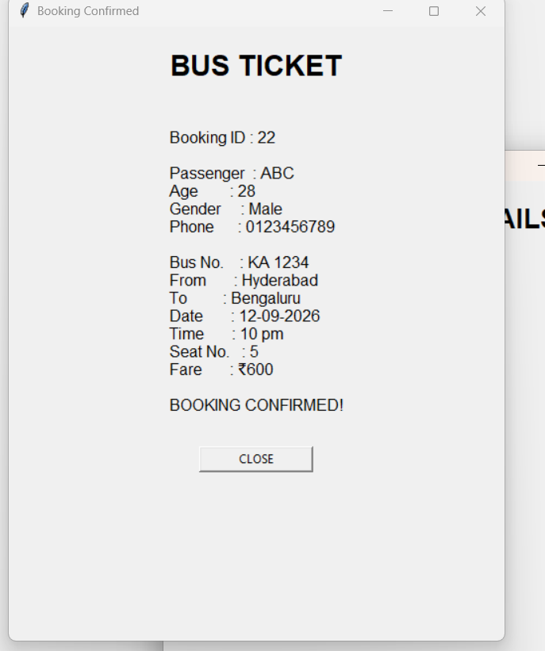

# Smart Bus Reservation System 🚌

A Python-based bus reservation system developed using Tkinter and SQLite. The application provides a simple graphical interface for searching buses, selecting seats, entering passenger details, confirming bookings, and managing reservations through an admin dashboard.

## Features

- Search buses by source, destination, and journey date
- Display available buses with timing and fare details
- Check seat availability
- Select a preferred seat
- Enter passenger details
- Confirm bus bookings
- Generate a bus ticket after successful booking
- View and manage existing bookings
- Admin login and dashboard
- Display booking statistics and revenue
- Delete bookings from the admin dashboard
- Store booking information using SQLite
- Graphical user interface built with Tkinter

## Technologies Used

- **Python**
- **Tkinter** – Graphical User Interface
- **SQLite3** – Database management

## Application Screenshots

### Home Screen


### Available Buses


### Seat Selection


### Passenger Details


### Bus Ticket



### Admin Dashboard


## How to Run

### 1. Install Python

Make sure Python is installed on your system.

### 2. Clone the Repository

```bash
git clone https://github.com/uzma80255-png/Smart-bus-reservation-system.git


```
